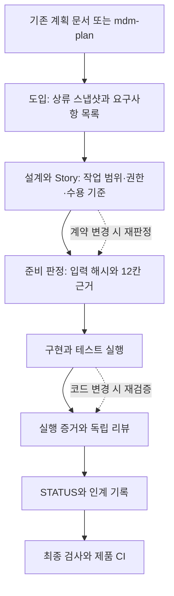

# my_dev_method — AI 개발 하네스

**V1.0.0 · 계획부터 구현, 검증, 다음 세션 인계까지 연결하는 dev-kit**

AI가 코드를 만드는 동안 요구사항과 설계가 바뀌면, 이전의 ‘준비 완료’나 ‘테스트 통과’는 더 이상 현재 작업의 근거가 아닐 수 있습니다. 이 하네스는 **요구사항 → Story → 계약 입력 → 준비 판정 → 실행 증거**를 연결해 그 차이를 검사합니다.

제품 저장소에 복사해 사용하는 [dev-kit](templates/dev-kit)입니다. 지시서와 문서 양식, Claude Code 커맨드·훅·리뷰 에이전트, Bash·Python 검사기를 함께 제공합니다. 기존 계획 문서를 가져올 수 있고, 계획이 없으면 `/mdm-plan`으로 작성합니다.

**처음 읽는 순서:** 이 README → [하네스 구성과 소스 안내](guides/harness-architecture.md) → [요구사항 하나로 따라가는 동작 예시](guides/harness-walkthrough.md).

## V1.0.0에서 달라진 것

최근 구현된 계약 근거·실행 증거·변경 운영 기능을 V1.0.0으로 묶었습니다.

- **현재 입력에 유효한 준비 판정:** 계약 파일의 SHA-256, Story 의존 관계, 판정 당시 입력을 대조합니다. 입력이 바뀌면 과거 판정을 그대로 사용하지 않습니다.
- **현재 코드에 연결된 완료 근거:** 수용 기준별 JUnit 실행 결과를 기록합니다. 실패·skip·미보고 테스트와 실행 중 입력 변경을 검사합니다.
- **요구사항 전체 대조:** 상류에서 추출한 ID마다 반영·보류·제외·삭제 처리를 기록하고 매핑 누락을 검사합니다.
- **변경과 세션 인계:** 영향별 의미 비교 기록, 검토한 동기화 묶음, 현재 파일에 연결된 인계 기록을 사용합니다.
- **제품 저장소의 최종 검사:** `mdm-check.sh`와 제품 CI 양식으로 정합성·증거·인계를 함께 확인합니다.

기존 프로젝트는 새 근거를 등록해야 합니다. [변경 내역과 이관 항목](CHANGELOG.md)을 먼저 확인하세요.

## 어떻게 구성되나



| 구성 | 역할 | 직접 확인할 자료 |
|---|---|---|
| 지시서·가이드 | 지금 읽을 문서, 단계, 역할과 결정 절차를 안내 | [CLAUDE.md](templates/dev-kit/CLAUDE.md), [단계별 가이드](templates/dev-kit/docs/guides/index.md) |
| 프로젝트 문서 | 상류·설계·Story·현재 상태의 정본 보관 | [문서 지도](templates/dev-kit/docs/MOC.md), [요구사항 추적표](templates/dev-kit/docs/spec/source-map.md) |
| 커맨드·에이전트 | 도입·계획·준비·리뷰·종료·오류 학습 수행 | [커맨드와 에이전트 구성](templates/dev-kit/.claude/README.md) |
| 검사기·증거 엔진 | 문서 구조, 입력 변경, 준비·실행 근거 검사 | [계약 근거 가이드](templates/dev-kit/docs/guides/contract-evidence.md) |
| 훅·CI | 도구 사용 시 검사 연결, 종료·통합 시 최종 확인 | [훅 설정](templates/dev-kit/.claude/settings.json), [제품 CI](templates/dev-kit/.github/workflows/mdm-check.yml) |

문서 간 의미가 맞는지, 권한 설계가 적절한지, 테스트가 충분한지는 독립 리뷰와 사용자 판단이 맡습니다. 스크립트는 등록된 구조·참조·내용 해시·실행 기록을 검사합니다. 구성요소별 호출 관계와 한계는 [구조 안내](guides/harness-architecture.md)에 정리했습니다.

## 빠르게 시작하기

Claude Code에서 커맨드·훅·서브에이전트를 사용하는 구성이 기본입니다. Bash, Git, Python 3.7 이상, `mktemp`, `jq`가 필요합니다. `jq`가 없으면 의존성·비밀값 guard 훅은 경고 후 통과하므로 설치 여부를 확인하세요.

다른 에이전트에서도 `AGENTS.md`로 규칙을 읽고 검사 스크립트를 직접 실행할 수 있습니다. Claude Code용 훅·커맨드·서브에이전트는 별도 연결 없이 자동 실행되지 않습니다.

### 1. 키트를 설치합니다

```bash
git clone https://github.com/JIM00N/my_dev_method.git
cd my_dev_method

# 이미 존재하는 제품 저장소 경로를 지정합니다.
bash scripts/install-kit.sh /path/to/product-repo
```

설치 출력의 버전은 `dev-kit v1.0.0`입니다. 대상에 `CLAUDE.md` 또는 `docs/`가 이미 있으면 신규 설치가 중단됩니다. 기존 파일과의 병합은 [설치·업그레이드 안내](templates/dev-kit/README.md)를 따릅니다.

### 2. 제품 저장소에서 도입을 시작합니다

제품의 `CLAUDE.md`에 프로젝트명·설명을 채우고, `docs/status/STATUS.md`에 시작 상태를 기록합니다. 제품 저장소에서 Claude Code를 열어 실행합니다.

```text
/mdm-adopt
```

에이전트가 계획 문서를 찾고 상류 스냅샷·요구사항 매핑을 준비합니다. 문서가 없으면 `/mdm-plan`으로 연결합니다. 이미 결정된 내용은 인용하고, 부족한 상태·권한·스택·검증 기준을 확인합니다. 상세 절차는 [S0 도입](templates/dev-kit/docs/guides/S0-adopt.md)이 정본입니다.

**설치만으로 도입이 끝나지는 않습니다.** 요구사항 처리 목록 작성과 명시적 `adopt`, 작업할 Story 등록·준비 판정이 필요합니다. 작성 중 사용하는 `--init` 검사는 운영 통과를 뜻하지 않습니다.

### 3. 작업하고 검증합니다

| 시점 | 진입점 | 남기는 것 |
|---|---|---|
| 세션 시작 | `/mdm-stage` | 현재 STATUS와 단계 확인 |
| Story 구현 전 | `/mdm-ready` | 작업 범위·12칸 근거·현재 입력에 대한 준비 판정 |
| 구현 한 덩어리 완료 | `/mdm-review` | 기계 검사와 구현 컨텍스트에서 분리된 리뷰 |
| 상류 변경 확인 | `/mdm-adopt --sync` | 변경 검토·동기화·필요한 재판정 |
| 에러 기록 종합 | `/mdm-ingest-errors` | 공통 원인과 적용 조건을 검토한 학습 규칙 |
| 사이클 종료 | `/mdm-cycle-close` | 검수·증거·인계·아카이브 |

세션 종료 전에는 STATUS를 갱신하고 현재 파일에 연결된 인계 기록을 남깁니다. 최종 검사는 **제품 저장소에서** 실행합니다.

```bash
bash .claude/scripts/mdm-check.sh
```

이 명령은 정합성·등록된 증거·인계를 검사합니다. 프로젝트 테스트를 자동으로 선택해 실행하지는 않습니다. 테스트 실행을 증거로 남기는 `verify`와 인계 작성 방법은 [계약 근거](templates/dev-kit/docs/guides/contract-evidence.md), [변경 운영](templates/dev-kit/docs/guides/operating-loop.md)을 참고하세요.

## 제품 저장소에 들어가는 것

```text
product-repo/
├── CLAUDE.md / AGENTS.md       에이전트 진입점과 규칙 라우팅
├── .claude/
│   ├── commands/              mdm-adopt·plan·ready·review 등
│   ├── agents/                코드 리뷰·오류 학습
│   ├── hooks/                 의존성·비밀값·종료 검사
│   └── scripts/               정합성·계약·운영·리포트 엔진
├── .github/workflows/         제품 최종 검사 CI
└── docs/
    ├── upstream/              상류 스냅샷·출처·해시
    ├── guides/                실행 절차 — 키트가 관리
    ├── spec/                  요구사항 추적·도메인·인터페이스·설계
    ├── plan/                  로드맵·사이클·Story
    ├── status/                현재 상태와 다음 행동
    ├── quality/               이슈·검수·학습 기록
    ├── decisions/             주요 결정과 근거
    ├── meta/                  도입·요구사항·Story 연결 정보
    └── evidence/              준비·실행·인계 증거
```

`meta/`와 `evidence/`는 운영 명령이 생성하며 제품 저장소에서 버전 관리합니다. 사람이 채운 사양·작업·품질·결정 기록도 제품의 소유입니다. HTML 리포트는 다시 만들 수 있는 생성물입니다.

Lite / Standard / Full [프로파일](templates/dev-kit/docs/guides/profiles.md)로 프로젝트에 맞는 절차량을 선택합니다. Lite에서도 계약·테스트·현재 증거·인계 확인은 유지합니다.

## 기존 버전에서 업그레이드

```bash
# my_dev_method 저장소에서 실행
bash scripts/install-kit.sh /path/to/product-repo --upgrade
```

설치기는 키트 소유 파일을 교체하고 프로젝트 기록은 보존합니다. `CLAUDE.md.dev-kit-new`와 `.claude/settings.json.dev-kit`가 생겼다면 기존 규칙·훅과 수동 병합합니다. 제품 CI 파일도 기존 파일이 있으면 보존합니다.

V1.0.0은 과거 체크 표시를 새 증거로 자동 승계하지 않습니다. [CHANGELOG](CHANGELOG.md)의 이관 항목을 따라 요구사항 목록 → adopt → Story 등록·의미 비교 → ready → 필요한 verify → handoff 순서로 연결하세요. 버전은 배포본 `CLAUDE.md` 첫 줄의 `dev-kit v1.0.0` 스탬프로 확인합니다.

## 참고 자료

| 알고 싶은 것 | 읽을 자료 |
|---|---|
| 하네스 내부 구조와 실제 구현 위치 | [구성도·호출 관계·소스 지도](guides/harness-architecture.md) |
| 요구사항이 준비·구현·검증·인계로 이어지는 과정 | [주문 삭제 기능으로 따라가는 예시](guides/harness-walkthrough.md) |
| 설계 배경과 역할 분리의 이유 | [왜 이렇게 설계했나](guides/getting-started.md) |
| 설치 파일의 소유권과 수동 병합 | [dev-kit 배포 안내](templates/dev-kit/README.md) |
| JSON 형식과 계약·실행 명령 | [계약 근거와 실행 증거](templates/dev-kit/docs/guides/contract-evidence.md) |
| 영향별 리뷰·동기화·인계·CI 진단 | [변경 운영 가이드](templates/dev-kit/docs/guides/operating-loop.md) |
| 실제 검증 코드와 합성 시나리오 | [계약 회귀](scripts/tests/test_contracts.py), [운영 회귀](scripts/tests/test_operations.py), [파일럿 리허설](examples/first-pilot/rehearsal.md) |
| 버전별 변경과 향후 개선 제안 | [CHANGELOG](CHANGELOG.md), [개발 시간 단축 개선 설계](docs/improvement-plan-development-time.md) — 개선 설계는 미구현 제안 |

파일 해시는 판정 당시 입력과 현재 입력의 일치 여부를 확인합니다. 승인자의 진실성, 자연어의 의미, 테스트의 충분함, 아직 수집하지 않은 원격 자료의 최신성까지 증명하지는 않습니다. 합성 리허설은 제공하지만 실제 제품의 개발 시간·재작업 감소 효과는 아직 측정하지 않았습니다.

## 하네스 자체 검증

이 저장소의 [CI](.github/workflows/docs-check.yml)는 문서 참조, 리뷰 게이트, 정합성, 리포트, 문서 검사기, 설치·업그레이드, 계약·운영 회귀를 검사합니다. 제품 저장소용 CI와 구분됩니다.

```bash
# my_dev_method 저장소에서 실행
bash scripts/check-docs.sh
bash scripts/test-install-upgrade.sh
python3 -m unittest discover -s scripts/tests -v
python3 scripts/run-pilot-rehearsal.py
```

전체 검사 명령은 [CI 정의](.github/workflows/docs-check.yml)에서 확인할 수 있습니다.

[MIT License](LICENSE)
