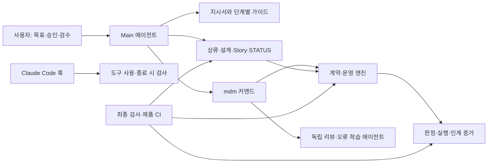
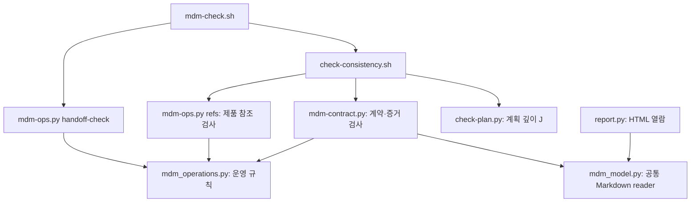
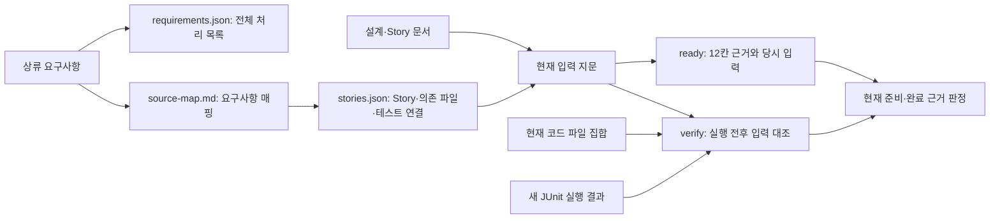

# V1.0.0 하네스 구성과 소스 안내

[README로 돌아가기](../README.md) · [동작 예시](harness-walkthrough.md)

이 문서는 하네스를 처음 읽는 사람을 위한 구현 지도입니다. 실행 절차와 JSON 형식의 정본은 [계약 근거](../templates/dev-kit/docs/guides/contract-evidence.md)와 [변경 운영](../templates/dev-kit/docs/guides/operating-loop.md) 가이드입니다.

## 먼저 구분할 두 저장소

| 위치 | 무엇을 소유하나 | 검사 진입점 |
|---|---|---|
| 이 저장소 `my_dev_method` | 배포 템플릿·설치기·하네스 회귀 검사·공개 설명 | `scripts/check-docs.sh`, `.github/workflows/docs-check.yml` |
| 키트를 설치한 제품 저장소 | 실제 요구사항·코드·계약·판정·실행·인계 기록 | `.claude/scripts/mdm-check.sh`, `.github/workflows/mdm-check.yml` |

이 저장소 루트의 `CLAUDE.md`와 `.claude/`는 **키트를 개발하는 작업 규칙**입니다. 제품에 배포되는 것은 [templates/dev-kit](../templates/dev-kit) 안의 파일입니다. 아래 소스 링크는 별도 표기가 없으면 배포본을 가리킵니다.

## 다섯 계층의 역할

1. **지시 계층:** [CLAUDE.md](../templates/dev-kit/CLAUDE.md)가 현재 단계의 가이드로 안내합니다. [AGENTS.md](../templates/dev-kit/AGENTS.md)는 다른 에이전트가 같은 규칙을 읽는 진입점입니다.
2. **문서 계층:** 상류 스냅샷은 출처, `spec/`은 제품 계약, `plan/`은 작업 단위, STATUS는 현재 상태를 맡습니다. 전체 탐색은 [MOC](../templates/dev-kit/docs/MOC.md)에서 시작합니다.
3. **실행 계층:** [커맨드](../templates/dev-kit/.claude/commands)는 작업 순서를 안내하고, [리뷰 에이전트](../templates/dev-kit/.claude/agents/mdm-code-review.md)와 [학습 에이전트](../templates/dev-kit/.claude/agents/mdm-error-learning.md)는 구현 컨텍스트에서 분리된 판단을 맡습니다.
4. **검사·증거 계층:** Bash·Python 프로그램이 표와 참조, 내용 해시, 테스트 결과, 인계를 대조합니다. 자연어 판단을 대체하지 않습니다.
5. **연결 계층:** [settings.json](../templates/dev-kit/.claude/settings.json)의 훅이 도구 사용·종료에 검사를 연결하고, [제품 CI](../templates/dev-kit/.github/workflows/mdm-check.yml)가 최종 검사를 실행합니다.

## 엔진 호출 관계

| 파일 | 읽을 때 볼 부분 |
|---|---|
| [mdm-check.sh](../templates/dev-kit/.claude/scripts/mdm-check.sh) | 최종 검사 입구. 정합성 검사 성공 후 인계 검사 실행 |
| [check-consistency.sh](../templates/dev-kit/.claude/scripts/check-consistency.sh) | 상류·요구사항·참조·등재·계획 검사와 계약 엔진 연결, `--init` 분기 |
| [check-plan.py](../templates/dev-kit/.claude/scripts/check-plan.py) | `self:plan` 계획의 요구사항→기능→사양 구조와 필수 표 검사 |
| [mdm-contract.py](../templates/dev-kit/.claude/scripts/mdm-contract.py) | adopt·register·inspect·ready·verify·render, 입력 지문과 증거 유효성 계산 |
| [mdm_model.py](../templates/dev-kit/.claude/scripts/mdm_model.py) | 검사기와 리포트가 공유하는 source-map 표 해석 |
| [mdm-ops.py](../templates/dev-kit/.claude/scripts/mdm-ops.py) / [mdm_operations.py](../templates/dev-kit/.claude/scripts/mdm_operations.py) | 요구사항 목록·영향별 비교·인계·동기화·복구·doctor |
| [report.py](../templates/dev-kit/.claude/scripts/report.py) | 문서를 HTML로 열람. 보고서 생성은 검사 통과나 승인 기록이 아님 |

## 계약과 증거의 연결

여기서 **계약**은 구현 전에 합의한 요구사항·동작·권한·수용 기준이며, **Story**는 구현할 작업 단위입니다. **입력 지문(fingerprint)**은 판정에 사용한 파일 내용과 연결 정보를 식별합니다.

과거 기록을 새 해시로 덮어써서 통과시키지 않습니다. 현재 입력과 당시 기록을 비교하고, 입력이 바뀌면 새 판정·실행 기록을 만듭니다. `render`는 그 계산 결과를 표에 표시합니다.

| 제품 경로 | 보관 내용 | 생성·갱신 주체 |
|---|---|---|
| `docs/upstream/` | 상류 스냅샷·manifest | 도입·동기화 |
| `docs/spec/source-map.md` | 요구사항·출처·조건 수·작업 상태와 계산된 표시 | 제품 작성자·render |
| docs/meta/project.json | 명시적 도입 상태 | adopt |
| docs/meta/requirements.json | 상류 추출 규칙·ID별 반영/보류/제외/삭제 | catalog와 결정 검토 |
| docs/meta/stories.json | Story·의존 파일·영향·수용 기준별 테스트 연결 | register와 검토한 변경 |
| `docs/evidence/readiness/` | 준비 판정 당시 입력과 12칸 근거 | ready |
| `docs/evidence/verification/` | 성공·실패 실행 기록과 입력 | verify |
| `docs/evidence/handoff/` | 완료·미결·결정·다음 행동·차단 사유와 파일 스냅샷 | handoff |

이 구조는 **파일 SHA-256과 의존 관계에 기반한 근거 추적**입니다. 이전 레코드의 해시를 다음 레코드에 연결하는 해시체인이나 서명된 감사 로그는 구현하지 않습니다. 같은 쓰기 권한을 가진 주체의 기록 조작을 방어하지도 않습니다.

## 무엇을 어디까지 검사하나

| 대상 | 기계가 확인하는 것 | 별도로 판단할 것 |
|---|---|---|
| 요구사항 | 설정한 추출 규칙의 ID와 처리 목록·매핑 일치 | 추출 규칙이 실제 요구사항 전체를 포괄하는가 |
| 준비 | 필수 슬롯·근거 구조·인용·현재 입력 일치 | 슬롯 내용과 의미 비교가 타당한가 |
| 완료 | 연결된 테스트의 새 JUnit 결과·현재 계약과 코드 일치 | 테스트가 실제 수용 기준을 충분히 검증하는가 |
| 인계 | 5칸 기록과 현재 파일 집합·내용 일치 | 다음 사람이 이어갈 만큼 설명이 충분한가 |
| 상류 동기화 | 검토한 묶음의 해시·처리 목록·복구 기록 | 가져온 자료가 원격의 최신 정본인가 |
| 훅 | 지원하는 도구 경로에서 의존성·비밀값 패턴 검사 | 모든 셸 표현·비밀값·에이전트 실행을 포괄하지 않음 |
| 제품 CI | 현재 파일과 기록된 증거·인계의 유효성 | CI의 실제 활성화·필수 검사 설정·제품 테스트 재실행 |

의존성·비밀값 guard는 `jq`가 없으면 경고 후 통과합니다. Stop 훅에는 반복 차단 방지가 있지만 최종 `mdm-check.sh`의 인계 검사에는 그 예외가 없습니다. [doctor 안내](../templates/dev-kit/docs/guides/operating-loop.md)는 로컬 파일 존재, 실제 검사 실행, 선택적 원격 관측을 구분합니다.

## 동작을 검증하는 자료

| 검증 범위 | 실행 가능한 소스 |
|---|---|
| 계약 변경·준비 무효화·JUnit·코드 변경 | [test_contracts.py](../scripts/tests/test_contracts.py) |
| 요구사항 누락·의미 충돌·동기화 중단·인계 | [test_operations.py](../scripts/tests/test_operations.py) |
| 계획·등재·정합성 회귀 | [test-consistency.sh](../scripts/test-consistency.sh) |
| 설치와 프로젝트 파일 보존 | [test-install-upgrade.sh](../scripts/test-install-upgrade.sh) |
| 하네스 개발 저장소의 커밋 게이트 | [test-review-gate.sh](../scripts/test-review-gate.sh) |
| 여섯 운영 시나리오 | [리허설 실행기](../scripts/run-pilot-rehearsal.py), [관측 기록](../examples/first-pilot/rehearsal.md) |

구조를 이해했다면 [주문 삭제 예시](harness-walkthrough.md)에서 각 파일과 판정이 언제 필요한지 확인할 수 있습니다.
