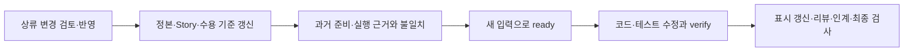

# V1.0.0 동작 예시 — 주문 삭제 요구사항 하나 따라가기

[README로 돌아가기](../README.md) · [하네스 구성과 소스](harness-architecture.md)

이 문서는 하네스가 남기는 기록과 검사 시점을 설명하는 **가상 제품 예시**입니다. 실행 가능한 완성 제품이나 실전 효과 측정 결과는 아닙니다. 실제 명령 인자·JSON 양식은 [계약 근거 가이드](../plugins/mdm/templates/docs/guides/contract-evidence.md)와 [변경 운영 가이드](../plugins/mdm/templates/docs/guides/operating-loop.md)를 따릅니다.

## 1. 요구사항을 가져옵니다

계획 문서에 다음 요구사항이 있다고 가정합니다.

> **FR-1 — 작성자는 자신의 주문을 삭제할 수 있다.**
> 수용 기준 AC-1: 작성자의 삭제 요청은 성공한다.
> 수용 기준 AC-2: 다른 사용자의 삭제 요청은 거부된다.

`/mdm:adopt`는 계획 문서의 스냅샷과 출처를 보관하고 요구사항을 매핑합니다. 전체 요구사항 목록에서 FR-1의 처리는 `include`, 매핑표의 조건 수는 2가 됩니다. 보류·제외한 요구사항은 이유와 결정 근거를 따로 남깁니다.

| 남기는 곳 | 예시 내용 |
|---|---|
| `docs/upstream/prd.md` | FR-1과 수용 기준의 스냅샷 |
| `docs/upstream/manifest.tsv` | 출처와 스냅샷 해시 |
| docs/meta/requirements.json | ID 추출 규칙·FR-1의 반영 결정 |
| `docs/spec/source-map.md` | FR-1 → 출처·조건 수·Story·작업 상태 |

목록과 매핑을 준비한 후 명시적으로 adopt합니다. 상류 ID를 추출하고도 처리 목록이나 반영 매핑에서 빠뜨리면 도입 검사가 실패합니다. [누락 회귀 사례](../scripts/tests/test_operations.py)에서 이 경로를 확인할 수 있습니다.

## 2. 구현할 Story와 권한 계약을 연결합니다

ST-001을 ‘주문 삭제’ 작업으로 정합니다. Story에 트리거·행동·결과·영향 범위·권한·수용 기준을 적고, 정본 도메인 문서를 의존 입력으로 등록합니다.

```text
FR-1
 └─ ST-001: 주문 삭제
     ├─ 계약: Story 문서 + domain.md 등 입력
     ├─ 영향: authorization
     ├─ AC-1 → Orders::test_owner_delete
     └─ AC-2 → Orders::test_other_user_denied
```

테스트 이름은 설명용 예시입니다. 실제 프로젝트 러너의 JUnit `classname::name`과 일치시켜야 합니다. Lite에서는 별도 Story 파일 대신 사이클 문서의 계약 슬롯을 연결할 수 있습니다.

등록 방법은 [Story 등록 예제](../plugins/mdm/templates/docs/guides/contract-evidence.md)를 참고합니다. `mdm-ops.py plan ST-001`은 등록된 영향에 따라 읽을 문서·비교 항목을 안내합니다.

## 3. 현재 계약으로 준비 여부를 판정합니다

`inspect ST-001`로 현재 입력 지문과 읽을 파일을 확인합니다. `/mdm:ready`는 상태·권한·규칙·데이터·예외·표시·검증과 동작의 전제·트리거·행동·결과·수용 기준, 총 12칸을 검토합니다.

이 사례의 핵심 질문은 ‘누가 어떤 주문을 삭제할 수 있는가’입니다. 정본과 Story의 허용·거부 경로를 비교하고, 양쪽에 ‘작성자만 허용’이 일치하는 근거를 남깁니다. 엔진은 영향별 비교 행과 실제 인용, 해결된 판정값을 검사합니다. 문장끼리 논리적으로 일치하는지는 리뷰가 판단합니다.

ready 기록에는 이때의 입력 지문과 슬롯별 근거가 보존됩니다. 이후 `domain.md`가 바뀌면, 그 이전 기록으로 현재 준비가 끝났다고 판단하지 않습니다.

## 4. 구현하고 실행 증거를 남깁니다

프로젝트에서 승인한 테스트 러너로 두 수용 기준을 검증합니다. `verify`는 새 JUnit 경로를 `MDM_JUNIT_OUTPUT` 환경 변수로 전달하고, 실행 전후의 계약·코드 입력을 비교합니다.

| 실행 결과 | 완료 근거로 사용할 수 있나 |
|---|---|
| 두 테스트 성공, 실행 전후 입력 동일 | 현재 실행 근거로 사용 가능 |
| 작성자 성공 테스트만 실행 | 거부 경로의 연결 테스트 미실행으로 실패 |
| 다른 사용자 거부 테스트가 skip | 실패 |
| 실행 명령 실패 또는 새 JUnit 없음 | 실패 |
| 테스트 실행 중 계약·코드 변경 | 입력 불일치로 실패 |

실패한 실행도 기록되며 이전 성공만 골라 현재 완료 근거로 사용하지 않습니다. 성공한 실행이 있어도 의미·권한·부작용의 적절성은 `/mdm:review`의 독립 리뷰가 확인합니다. 구현 사례는 [계약·실행 회귀](../scripts/tests/test_contracts.py)에 있습니다.

## 5. ‘관리자도 삭제 가능’으로 요구사항이 바뀝니다

상류 변경을 수집하고 동기화 후보의 스냅샷·처리 목록·매핑을 함께 검토합니다. `sync-preview`에서 확인한 묶음과 현재 입력이 같을 때 `sync-apply`로 반영합니다.

FR-1의 새 요구사항에 맞춰 정본·Story·테스트 연결을 검토합니다. 관리자 허용 조건을 추가했다면 조건 수와 수용 기준 매핑도 함께 변경합니다. 기존 2개 테스트의 성공만으로 새 계약이 완료됐다고 보지 않습니다.



동기화 중 프로세스가 강제 종료되어 복구 기록이 남으면 운영 검사는 실패합니다. 복구는 이전 상태를 되살리는 절차이며, 새 변경은 다시 preview부터 검토합니다. 구체적인 복구 방법은 [변경 운영 가이드](../plugins/mdm/templates/docs/guides/operating-loop.md)를 따릅니다.

## 6. 다음 세션이 이어갈 근거를 남깁니다

STATUS를 갱신한 후 인계 기록을 만듭니다.

| 인계 항목 | 예시 |
|---|---|
| done | 작성자·관리자 삭제 및 타인 거부 테스트 통과 |
| pending | 모바일 삭제 확인 화면 검수 |
| decisions | 관리자 허용으로 계약 변경 — 승인 근거 위치 |
| next | 모바일에서 삭제 확인·취소 흐름 확인 |
| blockers | 없음 |

handoff는 이 내용과 현재 파일 집합·해시를 연결합니다. 같은 날짜라도 STATUS나 추적 대상 파일이 바뀌면 새 인계가 필요합니다. 마지막에 제품 저장소에서 `mdm final`를 실행합니다.

제품 CI는 이 최종 검사를 실행합니다. 테스트 러너를 CI에서도 재실행하려면 해당 프로젝트의 verify 명령을 별도로 연결해야 합니다. 인계 내용이 충분한지와 남은 검수가 완료됐는지는 사람이 판단합니다.

## 실행 가능한 참고 자료

설명과 구현을 대조하려면 원본 `my_dev_method` 저장소에서 실행하세요. 임시 제품 저장소를 만들어 검사합니다.

```bash
python3 -m unittest discover -s scripts/tests -v
python3 scripts/run-pilot-rehearsal.py
```

[리허설](../examples/first-pilot/rehearsal.md)은 상류 누락, 미해결 의미 충돌, 동기화 반영·중단 복구, 인계 변경 감지, 제품 CI 보존의 여섯 시나리오를 다룹니다. 실제 제품에서 개발 시간이나 재작업이 줄었는지는 별도 [파일럿 측정](../examples/first-pilot/README.md)으로 확인해야 합니다.
